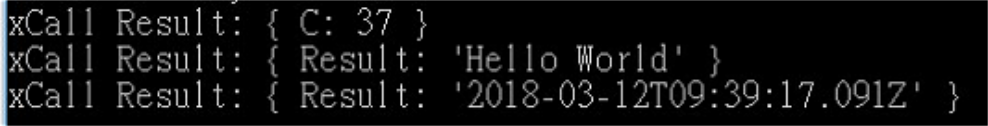

# How to develop Microservices

### **Required Environment**

_Node.js_

* **Step A**  

  * _Node.js_ source URL  __`https://nodejs.org/en/`

  

  * Download and install under '_C:\Program Files\nodejs'_ folder  __
  * Test the installation 
    * Open _&lt;Cmd&gt;_  shell and test if the installation was successful  `node -v  //shows version of nodejs`

\*\*\*\*

* **Step B**  

  * Open _&lt;Cmd&gt;_  shell and change directory to the Node.js folder  `cd C:\Program Files\nodejs`   
  * Create a _'project'_  folder under '_C:\Program Files\nodejs_ '

  
          __`mkdir C:\Program Files\nodejs\project`

  \_\_

  \_\_

  * _Change directory to 'C:\_ _Program Files\nodejs\project'_  `cd C:\Program Files\nodejs\project`

  * Initialize _Nodejs'  Node Package Manager \(NPM\)_   `npm init //initialize the node package manager`

           ...c_ontinuing to press 'enter' until finished with all the arguments that the installation throws up_  

  * Install _**MoteBus**_  using NPM  `npm install motebus --save //install MoteBus`

  * Add _Express_ package which provides for a _webserver socket_ running on the _user-defined port_   `npm install express --save //install Express`

\*\*\*\*

* **Step C** 
  * Install _MoteBus SDK_ 
    * _MoteBusHelloWorld_ download link  

      > `http://www.ypcloud.com/download/motebushelloworld.zip`

    * Unzip to extract the _HelloWorld_ folder & files and copy the same to _'C: \Program Files\_

      _nodejs\project'_  

    * Run _C:\Program Files\nodejs\project\HelloWorld\bin\MoteBus\_win32.exe_ as an _Administrator,_ ensuring before that TCP port _'6788'_  is open in the system's firewall 
  * Run _HelloWorld.js_  

    _`cd C:\nodejs\project\HelloWorld`_  
  
    `node index.js //run Helloworld`

\*\*\*\*

* **Step D**  

  * _Localhost_ test \(running it in the _local machine_\) __
    * Run _MoteTest.js_  

      _`cd C:\nodejs\project\HelloWorld\test`_  
  
      `node MoteTest.js`

                  

  

  * _Client Server_ test 
    * _Use a code editor to open MoteTest.js_ and modify the _third_ statement in the js file to replace _'127.0.0.1'_ with _'192.168.10.185'_

_P.S.: MoteTest.js_ is a test program used for testing the _Motebus_ connector, returns the test results for _Add\(\), Echo\(\) & Time\(\)_ _Mote_ functions

